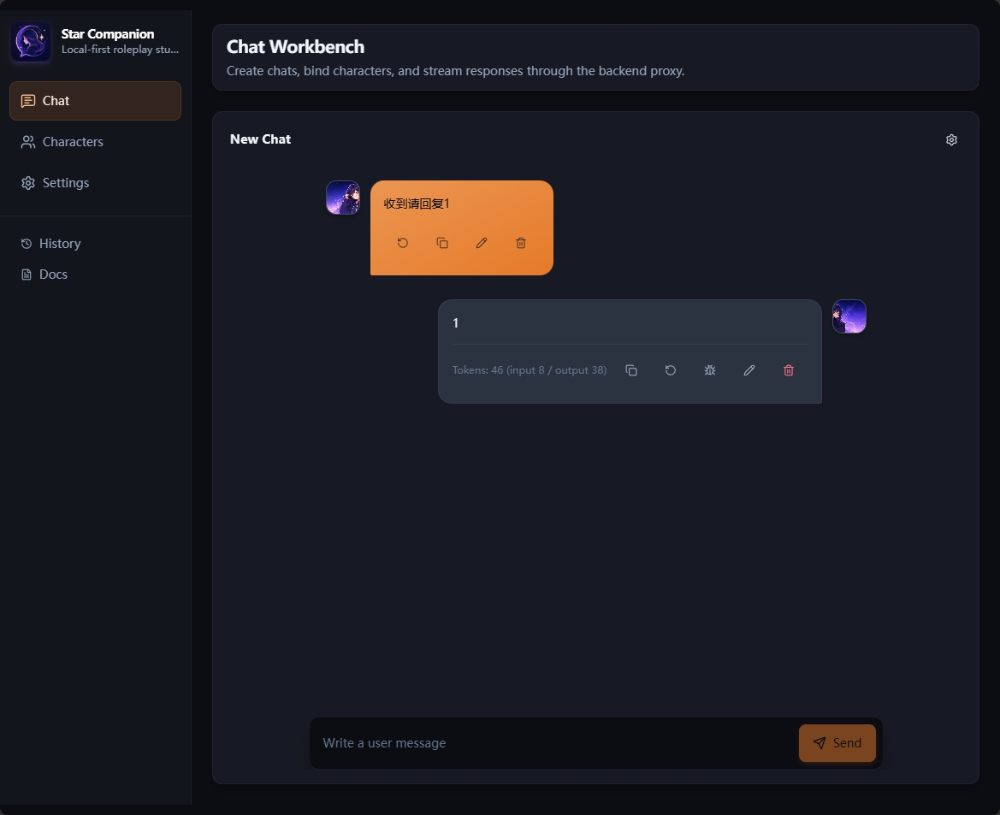
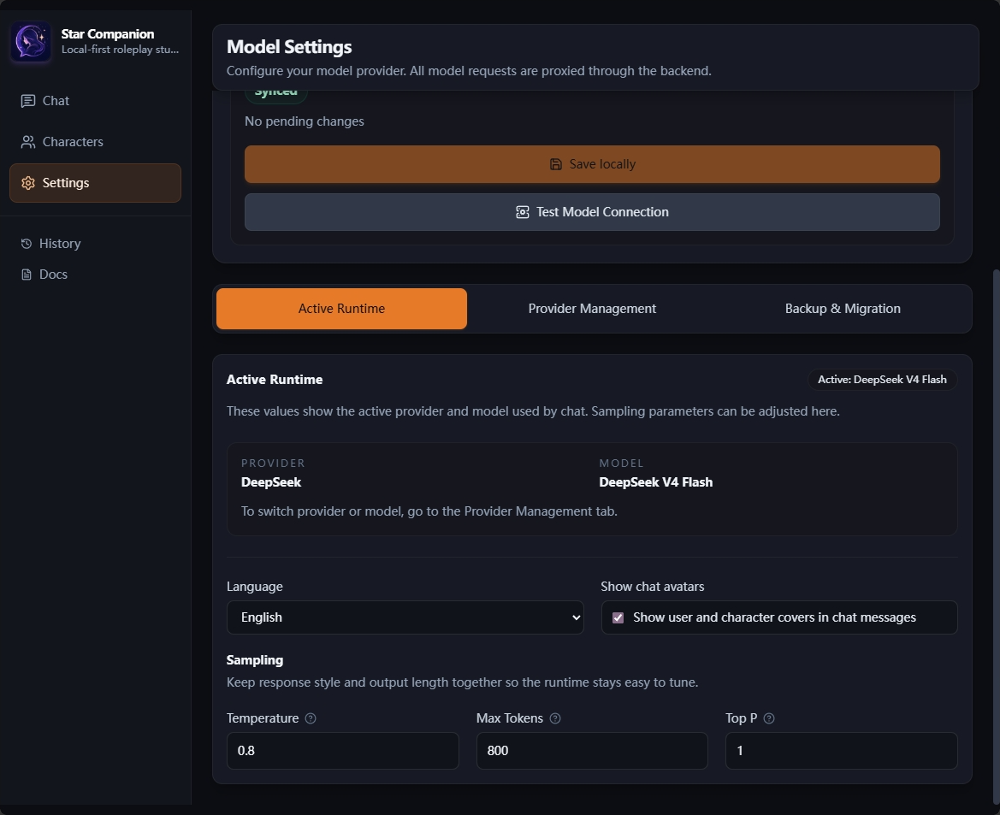

# Star Companion

[简体中文](readme-zh_cn.md) | English


Star Companion is a local-first AI character chat platform for single-user, single-character roleplay conversations.

It is built for users and developers who want a private, inspectable, locally runnable chat workspace. Character cards, streaming replies, embedded character lore, provider configuration, desktop packaging, and mobile sync scaffolding are maintained in one codebase.

## Preview





## Highlights

- Local-first data with SQLite and Prisma.
- Single-user, single-character chat model with no group-chat route.
- Character CRUD, import/export, private character-card unlocks, tags, quick replies, and avatar display.
- Three-part character prompts: `prefix`, `prompt`, and `suffix`.
- Embedded character `loreEntries` keyword injection, without a standalone world-book or lorebook API.
- Streaming replies over WebSocket, stop generation, regenerate, edit, delete, copy, and switch message variants.
- OpenAI-compatible backend proxy plus native Anthropic Claude and Google Gemini adapters.
- Model presets, provider templates, batch model ID import, and connection testing.
- Chat backgrounds, user persona, and automatic user-profile summary updates.
- Local backup import/export and manual LAN sync between desktop and mobile.
- Electron Windows desktop packaging and Android mobile build scaffolding.

## Product Scope

The project is maintained as "single-character chat + embedded character lore":

- No group chat.
- No standalone world-book / lorebook page, API, Prisma model, or backup protocol.
- Current frontend pages are `/`, `/characters`, `/settings`, and `/docs`.
- Historical references to `firstMessage`, `exampleDialog`, `scenario`, `systemPrompt`, or old lorebook fields should be treated as compatibility context or technical debt, not the current product direction.

## Tech Stack

- Frontend: React + TypeScript + Vite
- UI: Tailwind CSS
- State: Zustand
- Backend: Node.js + Express + TypeScript
- Database: SQLite + Prisma
- Realtime: WebSocket
- Desktop: Electron
- Mobile: Capacitor Android scaffold

## Quick Start

Requirements:

- Node.js 20+
- npm 11+

Install dependencies and prepare the database:

```bash
npm install
npm run db:generate
npm run db:migrate:deploy
npm run dev
```

Windows users can also run:

```powershell
.\start.cmd
```

Default URLs:

- Web: `http://localhost:5173`
- Server: `http://localhost:4000`
- Health: `http://localhost:4000/api/health`
- WebSocket: `ws://localhost:4000/ws`

The server environment template is located at [`../apps/server/.env.example`](../apps/server/.env.example). At minimum, configure:

```text
DATABASE_URL="file:./dev.db"
SERVER_PORT=4000
CORS_ORIGIN="http://localhost:5173"
API_KEY_ENCRYPTION_SECRET="replace-with-a-long-local-random-secret"
```

`API_KEY_ENCRYPTION_SECRET` is used to encrypt locally stored API keys with AES-256-GCM. Settings APIs do not return plaintext API keys; they only return whether a key is configured.

## Common Commands

```bash
npm run dev
npm run build
npm run lint
npm run test:server
npm run test:api
npm run test:e2e
npm run desktop:dev
npm run desktop:pack
npm run desktop:build
npm run mobile:sync
npm run mobile:build:android
```

Notes:

- `npm run dev` starts shared types, server, and web together.
- `npm run build` builds shared, server, and web.
- `npm run test:api` replays committed migration SQL into a fresh SQLite database before running API smoke checks.
- `npm run test:e2e` runs the Playwright frontend end-to-end suite.
- `npm run desktop:build` produces the Windows desktop installer.
- `npm run mobile:build:android` produces an Android debug APK.

Install Playwright Chromium before first E2E use if needed:

```bash
npm exec --prefix apps/web playwright install chromium
```

## Project Layout

```text
apps/
  web/             React frontend
  server/          Express backend + Prisma
  desktop/         Electron entrypoint
  mobile-backend/  Mobile-side backend helper service
packages/
  shared/          Shared frontend/backend types
scripts/
  desktop/         Desktop packaging helpers
  dev/             Local development helpers
  mobile/          Mobile packaging and smoke scripts
docs/
  platforms/       Platform notes
.github/
  workflows/       GitHub Actions workflows
```

## API And Data Model

Main HTTP routes:

- `/api/health`
- `/api/characters`
- `/api/chats`
- `/api/messages`
- `/api/settings`
- `/api/backups`
- `/api/sync`

Realtime entrypoint:

- `ws://localhost:4000/ws`

Source-of-truth data model files:

- [`../apps/server/prisma/schema.prisma`](../apps/server/prisma/schema.prisma)
- [`../packages/shared/src/index.ts`](../packages/shared/src/index.ts)

Core models:

- `UserSettings`: provider, model parameters, language, encrypted API key, model presets, and user-profile summary.
- `Character`: `cardId`, `name`, `avatar`, `description`, `prefix`, `prompt`, `suffix`, `htmlCss`, `openingHtml`, `tags`, `loreEntries`, `quickReplies`.
- `Chat`: `title`, `characterId`, `memoryTurns`, `backgroundUrl`, `userPersona`, `userProfileSummary`.
- `Message`: `chatId`, `role`, `characterId`, `content`, `variants`, `activeVariantIndex`, `tokenUsage`, `loreMatches`.

## Development Notes

- All third-party LLM requests must go through the backend proxy.
- The frontend must not hold or call third-party model API keys directly.
- Logs must not leak API keys, user-profile summaries, or real chat content.
- Data model changes should be checked across Prisma schema, Zod schema, serializers, shared types, web API client, README, smoke tests, and E2E coverage.
- Prompt-structure changes must update server tests.
- Contributions should stay within the current product boundary: single-character chat plus embedded character lore.

## License

This project is licensed under [`AGPL-3.0-or-later`](../LICENSE).

AGPL was chosen because Star Companion is a complete local-first web / desktop application that may also be deployed as a server service. The license permits use, study, modification, and redistribution, while requiring source availability when modified versions are provided over a network.
